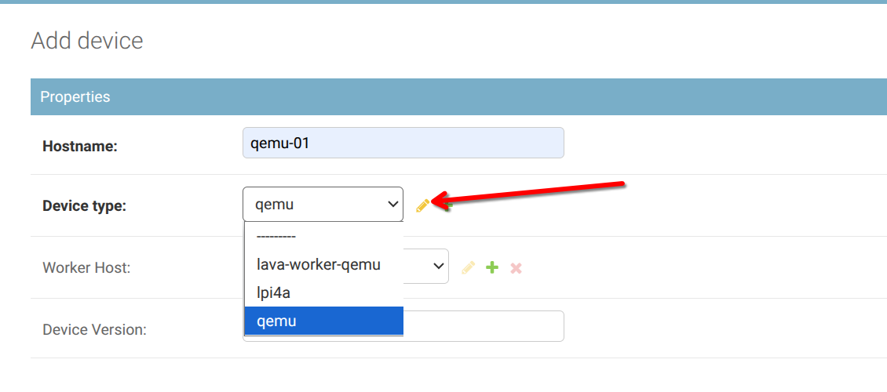
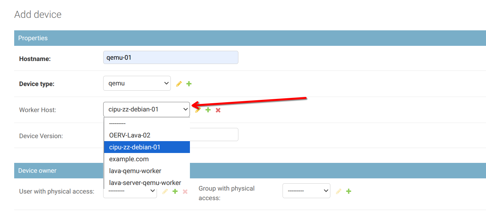
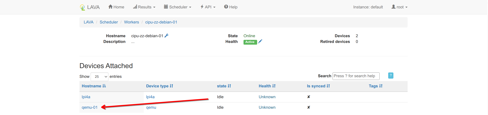
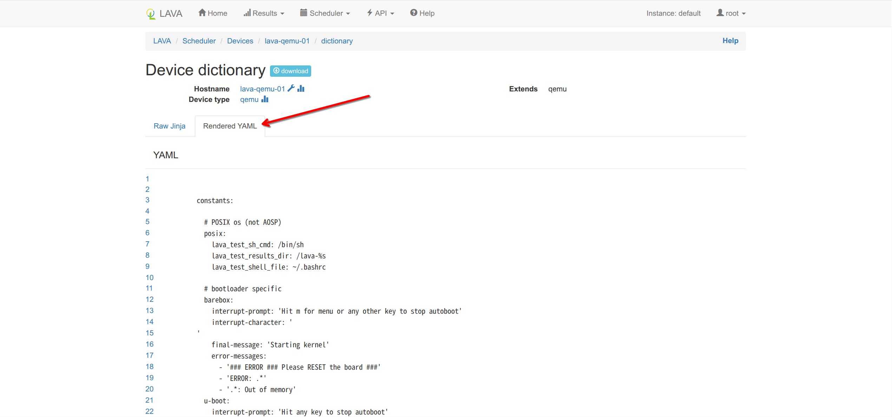

# 添加 QEMU 测试设备

> 在 server 端添加 qemu 的方式是一样的，不过要在 server 机器上 [安装并配置 worker](https://iscas-oerv.feishu.cn/wiki/ED1zw4voNiOmyCksVgmcuhXNnKg#share-M197detJVo7CTDxs5oLcOg2Jn1v)，之后进行本文档下面的步骤：为 Worker 添加一个 Device ，并在 server 上配置连接 QEMU，准备 qemu 环境

## 添加 device-type

在服务端运行如下命令

> `lava-server manage device-types add qemu`

* 或者添加全部可用设备类型

> `lava-server manage device-types add '*'`

### 为 Worker 添加一个 Device

在服务端运行如下命令

> `lava-server manage devices add --device-type qemu --worker <Worker名> <设备名>`

如：

> `lava-server manage devices add --device-type qemu --worker cipu-zz-debian-01 `​`qemu-01`

### 或者可以使用 GUI 界面为 Worker 添加一个 Device（需要添加 device 文件）：








## 使用 LAVA-Worker 连接 QEMU

### 编写一个描述 QEMU 的 Device Dictionary 文件

根据官网上的`Adding a dictionary to the first QEMU device`部分，需要在 **server** 上为这个 Device `qemu-01` 创建一个 jinja2 模板描述文件，称为`Device Dictionary`。

对某个 Device 的操作定义为，使用以下内容与顺序，渲染出一个最终的 yaml 进行操作：

> https://docs.lavasoftware.org/lava/dispatcher-format.html?highlight=render
> 
> ... The above [device dictionary](https://docs.lavasoftware.org/lava/glossary.html#term-device-dictionary) and the [device type](https://docs.lavasoftware.org/lava/glossary.html#term-device-type) template are combined together in order to form the device configuration ...

这里选用使用 Device Dictionary 对基础操作方式进行编写，其内容为对 device-type 进行扩展，参照 [LAVA 的 QEMU 描述文件](https://gitlab.com/lava/lava/-/blob/master/etc/dispatcher-config/device-types/qemu.jinja2?ref_type=heads)（以及其依赖[ base.jinja2 ](https://gitlab.com/lava/lava/-/blob/master/etc/dispatcher-config/device-types/base.jinja2)文件）与上个段落中的启动指令，在 server 上新建文件`/etc/lava-server/dispatcher-config/devices/qemu-01.jinja2`并对其进行编辑

⚠️ **这里的 jinja2 文件名称和新添加的 Device 名称需要保持一致**

```Plain


```

注意：如果你还没有为当前用户添加 Identity，可能会报`Unknown identity 'default'`，解决方法[查看这里](./1.LAVA主从机部署文档.md#为普通用户添加-identity)。

在对 jinja2 文件进行保存后，可以使用以下命令渲染得到 `qemu-01` 设备的 yaml 配置文件

> `lavacli -i arbitary_user devices dict get --render qemu-01`

下面是通过上述命令由 `qemu-01.jinja2` 渲染出的 qemu-01 设备的 yaml 文件，定义了测试环境常量，配置多架构支持；自动化测试流程控制，包括部署方法和启动选项，另外还包括错误检测与重试机制。

```YAML
constants: 

  # POSIX os (not AOSP) 
  posix: 
    lava_test_sh_cmd: /bin/sh 
    lava_test_results_dir: /lava-%s 
    lava_test_shell_file: ~/.bashrc 

  # bootloader specific 
  barebox: 
    interrupt-prompt: 'Hit m for menu or any other key to stop autoboot' 
    interrupt-character: ' 
' 
    final-message: 'Starting kernel' 
    error-messages: 
      - '### ERROR ### Please RESET the board ###' 
      - 'ERROR: .*' 
      - '.*: Out of memory' 
  u-boot: 
    interrupt-prompt: 'Hit any key to stop autoboot' 
    interrupt-character: ' ' 
    interrupt_ctrl_list: [] 
    interrupt-newline: True 
    final-message: 'Starting kernel' 
    error-messages: 
      - 'Resetting CPU' 
      - 'Must RESET board to recover' 
      - 'TIMEOUT' 
      - 'Retry count exceeded' 
      - 'Retry time exceeded; starting again' 
      - 'The remote end did not respond in time.' 
      - 'File not found' 
      - 'Bad Linux ARM64 Image magic!' 
      - 'Wrong Ramdisk Image Format' 
      - 'Ramdisk image is corrupt or invalid' 
      - 'ERROR: Failed to allocate' 
      - 'TFTP error: trying to overwrite reserved memory' 
      - 'Bad Linux RISCV Image magic!' 
      - 'Wrong Image Format for boot' 
      - 'ERROR: Did not find a cmdline Flattened Device Tree' 
      - 'ERROR: RD image overlaps OS image' 
      - 'kernel_comp_addr_r or kernel_comp_size is not provided' 
    dfu-download: 'DOWNLOAD \.\.\. OK\r\nCtrl\+C to exit \.\.\.' 
  grub: 
    interrupt-prompt: 'for a command-line' 
    interrupt-character: 'c' 
    interrupt-newline: False 
    error-messages: 
      - "error: missing (.*) symbol." 
  grub-efi: 
    interrupt-prompt: 'for a command-line' 
    interrupt-character: 'c' 
    error-messages: 
      - 'Undefined OpCode Exception PC at' 
      - 'Synchronous Exception at' 
      - "error: missing (.*) symbol." 
  ipxe: 
    interrupt-prompt: 'Press Ctrl-B for the iPXE command line' 
    interrupt_ctrl_list: ['b'] 
    error-messages: 
      - 'No configuration methods succeeded' 
      - 'Connection timed out' 
  depthcharge: 
    final-message: 'Starting kernel' 
    error-messages: 
      - 'Tftp failed.' 
      - 'Dhcp release failed.' 
      - 'No space left for ramdisk' 
      - 'TFTP failed for ramdisk.' 
      - 'Dhcp release failed.' 
      - 'Out of space adding TFTP server IP to the command line.' 
      - 'No network device.' 
      - 'Error code \d+( \([\w\s]+\))?\r\n' 
  # OS shutdown message 
  # Override: set as the shutdown-message parameter of an Action. 
  # SHUTDOWN_MESSAGE 
  shutdown-message: 'The system is going down for reboot NOW' 

  # Kernel starting message 
  kernel-start-message: 'Linux version [0-9]' 

  # Default shell prompt for AutoLogin 
  # DEFAULT_SHELL_PROMPT 
  default-shell-prompt: 'lava-test: # ' 

  # pexpect.spawn maxread 
  # SPAWN_MAXREAD - in bytes, quoted as a string 
  # 1 to turn off buffering, pexpect default is 2000 
  # maximum may be limited by platform issues to 4092 
  # avoid setting searchwindowsize: 
  # Data before searchwindowsize point is preserved, but not searched. 
  spawn_maxread: '4092' 

  # Set the failure retry to default or override it 
  failure_retry: 1 
  # Override boot_retry 
  boot_retry:  
parameters: 
  # interfaces or device_ip or device_mac 

  pass: # sata_uuid_sd_uuid_usb_uuid 


available_architectures: 
- arm64 
- arm 
- aarch64 
- amd64 
- x86_64 
- hppa 
- i386 
- mips 
- mipsel 
- mips64 
- mips64el 
- nios2 
- ppc 
- ppc64 
- ppc64le 
- riscv32 
- riscv64 
- sparc 
- sparc64 
- alpha 
- cris 
- lm32 
- m68k 
- microblaze 
- microblazeel 
- moxie 
- or32 
- s390x 
- sh4 
- sh4eb 
- tricore 
- unicore32 
- xtensa 
- xtensaeb 

actions: 
  deploy: 
    connections: 
      serial: 
      lxc: 
    methods: 
      nfs: 
      lxc: 
      image: 
        parameters: 
          guest: 
            size: 512  # in Mb 
            interface: ide 
            driveid: lavatest 
  boot: 
    connections: 
      serial: 
      ssh: 
      lxc: 
    methods: 
      minimal: 
      qemu: 
        parameters: 
          command: 
            qemu-system- 
          # used by installers to relate to the empty target device 
          boot_options: 
            {root: /dev/sda1, console: ttyS0,115200} 
          options: 
          - -nographic 
          - -net nic,model=virtio,macaddr=52:54:00:12:34:58 -net user 
          - -m 512 
          - -monitor none 
      qemu-nfs: 
        parameters: 
          command: 
            qemu-system- 
          # used by installers to relate to the empty target device 
          boot_options: 
            {root: /dev/sda1, console: ttyS0,115200} 
          options: 
          - -nographic 
          - -net nic,model=virtio,macaddr=52:54:00:12:34:58 -net user 
          - -m 512 
          - -monitor none 

          append: 
            console: ttyAMA0 
            root: /dev/nfs 
            nfsrootargs: nfsroot={NFS_SERVER_IP}:{NFSROOTFS},tcp,hard 
            ipargs: ip=dhcp 
  test: 
    methods: 
      docker: 
        # Docker-shell additional command-line options. Can be given as 
        # a list here, or additional options can be taken from device 
        # dict vars below (which in turn can be not defined (== null), 
        # a string, or an inline list of strings). 
        global_options: 
        -  
        options: 
        -  
timeouts: 
  actions: 
    apply-overlay-image: 
      minutes: 2 
    dd-image: 
      minutes: 10 
    download-retry: 
      minutes: 5 
    http-download: 
      minutes: 5 
    lava-test-shell: 
      minutes: 3 
    nfs-deploy: 
      minutes: 10 
    power-off: 
      seconds: 10 
    bootloader-commands: 
      minutes: 3 
    bootloader-interrupt: 
      seconds: 30 
    u-boot-interrupt: 
      seconds: 30 
    umount-retry: 
      seconds: 45 
    auto-login-action: 
      minutes: 2 
    bootloader-action: 
      minutes: 3 
    uboot-action: 
      minutes: 3 
    uboot-commands: 
      minutes: 3 
    bootloader-retry: 
      minutes: 3 
    boot-qemu-image: 
      minutes: 2 
    boot-image-retry: 
      minutes: 2 
    flash-uboot-ums: 
      minutes: 20 
    musca-deploy: 
      minutes: 3 
    musca-boot: 
      minutes: 1 
    unmount-musca-usbmsd: 
      seconds: 30 
    pdu-reboot: 
      seconds: 30 
    reset-device: 
      seconds: 30 
  connections: 
    dd-image: 
      minutes: 10 
    uboot-commands: 
      seconds: 30 
    bootloader-commands: 
      seconds: 30 
    auto-login-action: 
      minutes: 2 
    bootloader-interrupt: 
      seconds: 30 
    u-boot-interrupt: 
      seconds: 30 
    lava-test-shell: 
      seconds: 10 
    lava-docker-test-shell: 
      seconds: 10
```

或者在网页中查看 `qemu-01` 设备的 yaml 配置文件：




## 准备 qemu 环境

在完成上述的 lava 配置后，若直接提交运行 qemu job 会出现以下报错，原因是还未在 worker 中安装 qemu 环境

```Bash
definition: lava
case: job
result: fail
error_msg: [Errno 2] No such file or directory: 'qemu-system-riscv64'
error_type: Bug
```

### 安装 qemu

需要先执行：

```Bash
sudo apt update
sudo apt install qemu-system-riscv
```

update 如果出现如下报错：

```Java
root@OERV-Lava-04:~# apt update 
Hit:1 https://mirror.iscas.ac.cn/debian bookworm InRelease 
Get:2 https://mirror.iscas.ac.cn/debian bookworm-updates InRelease [55.4 kB] 
Get:3 https://mirror.iscas.ac.cn/debian bookworm-backports InRelease [59.4 kB] 
Get:4 https://mirror.iscas.ac.cn/debian-security bookworm-security InRelease [48.0 kB] 
Hit:5 https://apt.lavasoftware.org/archive/2025.04 bookworm InRelease 
Reading package lists... Done 
E: ​Release file for https://mirror.iscas.ac.cn/debian/dists/bookworm-updates/InRelease is expired (invalid since 10d 16h 51min 23
s). Updates for this repository will not be applied. 
E: ​Release file for https://mirror.iscas.ac.cn/debian/dists/bookworm-backports/InRelease is expired (invalid since 10d 16h 51min 
23s). Updates for this repository will not be applied. 
E: ​Release file for https://mirror.iscas.ac.cn/debian-security/dists/bookworm-security/InRelease is expired (invalid since 19h 48
min 48s). Updates for this repository will not be applied.
```

原因是 apt 源过期，需要禁用过期检查，并从 bookworm-backports 安装 qemu

```Bash
echo 'Acquire::Check-Valid-Until "0";' | sudo tee /etc/apt/apt.conf.d/10no-check-valid-until
sudo apt update
sudo apt -t bookworm-backports install qemu-system
```

## qemu job 示例

```YAML
# Your first LAVA JOB definition for an riscv_64 QEMU
device_type: qemu
job_name: qemu-ltp-math-test
timeouts:
  job:
    minutes: 10250
  action:
    minutes: 10240
  connection:
    minutes: 10
priority: medium
visibility: public
# context allows specific values to be overridden or included
context:
  # tell the qemu template which architecture is being tested
  # the template uses that to ensure that qemu-system-riscv64 is executed.
  arch: riscv64
  machine: virt
  guestfs_interface: virtio
  extra_options:
    - -machine virt
    - -nographic
    - -smp 4
    - -m 4G
    - -device virtio-blk-device,drive=hd0
    - -append "root=/dev/vda rw console=ttyS0 selinux=0"
    - -device virtio-net-device,netdev=usernet
    - -netdev user,id=usernet,hostfwd=tcp::14126-:22
metadata:
  # please change these fields when modifying this job for your own tests.
  format: Lava-Test Test Definition 1.0
  name: qemu-riscv64-test
  description: "test for riscv64 qemu"
  version: "1.0"
# ACTION_BLOCK
actions:
  # DEPLOY_BLOCK
  - deploy:
      timeout:
        minutes: 120
      failure_retry: 5
      to: tmpfs
      images:
        kernel:
          image_arg: -kernel {kernel}
          url: http://10.211.102.58/kernel-build-results/rvck-olk_pr_68/Image
        rootfs:
          image_arg: -drive file={rootfs},format=raw,id=hd0,if=none
          url: https://fast-mirror.isrc.ac.cn/openeuler-sig-riscv/openEuler-RISC-V/RVCK/openEuler24.03-LTS-SP1/openeuler-rootfs.img
  # BOOT_BLOCK
  - boot:
      timeout:
        minutes: 20
      method: qemu
      media: tmpfs
      prompts: ["root@openeuler-riscv64"]
      auto_login:
        login_prompt: "openeuler-riscv64 login:"
        username: root
        password_prompt: "Password:"
        password: openEuler12#$
  # TEST_BLOCK
  - test:
      timeout:
        minutes: 10100
      definitions:
        - repository: https://github.com/RVCK-Project/lavaci.git
          from: git
          name: ltp-math
          path: lava-testcases/common-test/ltp/ltp.yaml
          parameters:
            TST_CMDFILES: math
```

## 下一步：

-> [添加一个实体设备 - lpi4a](./3.添加一个实体设备-lpi4a.md)
