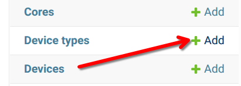
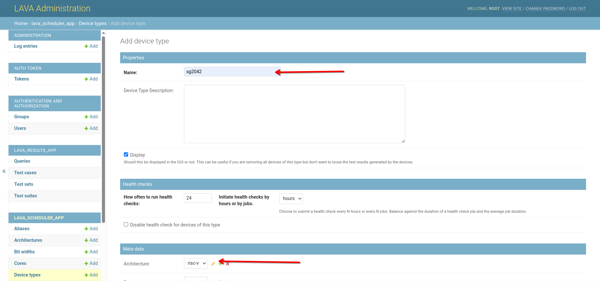
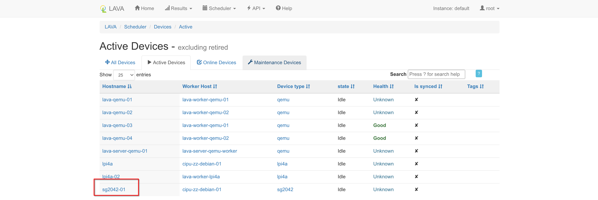

# 添加一个实体设备 - sg2042

## 为当前设备添加一个 Device Type





> Architecture 和 Processor 需要点击右侧 + 号添加，缺少的部分可以补充也可以留空

## 安装 tftp 并配置

sg2042 通过 LinuxBoot 的 `pxeboot` 从 TFTP 获取内核、initramfs 和设备树文件，LAVA 会在 deploy 阶段将这些文件放到当前 Job 的 TFTP 目录，所以需要先在 worker 机器上安装并配置 tftp。安装 lava-dispatcher 时应该会默认安装 tftpd-hpa，若没有则：

```Bash
sudo apt install tftpd-hpa
```

tftp 配置文件类似于：

```TypeScript
zhtianyu@debian:~/lpi4a$ cat /etc/default/tftpd-hpa  
# /etc/default/tftpd-hpa 

TFTP_USERNAME="tftp" 
TFTP_DIRECTORY="/srv/tftp" 
TFTP_ADDRESS=":69" 
TFTP_OPTIONS="--secure"
```

## 安装 NFS server 并配置

sg2042 通过 NFS 的方式获取文件系统相关文件，需要在 worker 安装并配置 NFS server。安装 lava-dispatcher 时应该会默认安装 nfs-kernel-server ，若没有则：

```Bash
sudo apt install nfs-kernel-server
```

lava 默认会在`/etc/exports.d/lava-dispatcher-nfs.exports`配置 NFS 共享目录：

```Shell
zhtianyu@debian:~$ cat /etc/exports.d/lava-dispatcher-nfs.exports 
# /etc/exports: the access control list for filesystems which may be exported 
#               to NFS clients.  See exports(5). 
# 
# Example for NFSv2 and NFSv3: 
# /srv/homes       hostname1(rw,sync,no_subtree_check) hostname2(ro,sync,no_subtree_check) 
# 
# Example for NFSv4: 
# /srv/nfs4        gss/krb5i(rw,sync,fsid=0,crossmnt,no_subtree_check) 
# /srv/nfs4/homes  gss/krb5i(rw,sync,no_subtree_check) 
# 

/var/lib/lava/dispatcher/tmp *(rw,no_root_squash,async,no_subtree_check,crossmnt)
```

若没有配置，则：

```Plain
vim /etc/exports.d/lava-dispatcher-nfs.exports
/var/lib/lava/dispatcher/tmp *(rw,no_root_squash,async,no_subtree_check,crossmnt)
sudo exportfs -rav
```

### 使用 Job 动态 NFS rootfs

SG2042 不再使用固定的 `persistent_nfs` 和 `sg2042_rootfs`。Job 在 deploy 阶段提供 `nfsrootfs.url`，LAVA 会为每个 Job 解压独立 rootfs 目录：

```text
/var/lib/lava/dispatcher/tmp/<JOB_ID>/extract-nfsrootfs-<RANDOM>
```

device-type 中的 `{NFS_SERVER_IP}` 和 `{NFSROOTFS}` 会被 LAVA 替换为 worker 地址和当前 Job 的解压目录。Job 结束后由 LAVA 清理该目录，不再需要 `reset_nfsrootfs` 脚本。


## 在服务端添加 Worker 连接的 Device

在 LAVA 服务端命令行执行

`lava-server manage devices add --device-type sg2042 --worker cipu-zz-debian-01 sg2042-01`

执行成功后在 Web 界面`Scheduler > Devices`可以查询到



## 为 sg2042 添加 device-type 基础模板

将 sg2042 的 device-type 存储在 server 下的 `/etc/lava-server/dispatcher-config/device-types/sg2042.jinja2` 中

```jinja2
{# device_type = "sg2042" #}
















{% set sg2042_commands = [
    '/bbin/dhclient -ipv6=false eth0',
    '/bbin/mkdir -p ' + sg2042_pxelinux_dir,
    "/bbin/echo -E 'title openEuler Boot Menu' > " + sg2042_pxelinux_config,
    "/bbin/echo -E 'prompt 0' >> " + sg2042_pxelinux_config,
    "/bbin/echo -E 'timeout 3' >> " + sg2042_pxelinux_config,
    "/bbin/echo -E 'default LAVA' >> " + sg2042_pxelinux_config,
    "/bbin/echo -E 'label LAVA' >> " + sg2042_pxelinux_config,
    "/bbin/echo -E 'menu label openEuler | LAVA Milk-V Pioneer' >> " + sg2042_pxelinux_config,
    "/bbin/echo -E 'linux tftp://{SERVER_IP}/{KERNEL}' >> " + sg2042_pxelinux_config,
    "/bbin/echo -E 'initrd tftp://{SERVER_IP}/{RAMDISK}' >> " + sg2042_pxelinux_config,
    "/bbin/echo -E 'fdt tftp://{SERVER_IP}/{DTB}' >> " + sg2042_pxelinux_config,
    '/bbin/echo -E ' + sg2042_pxelinux_append + ' >> ' + sg2042_pxelinux_config,
    '/bbin/cat ' + sg2042_pxelinux_config,
    '/bbin/pxeboot -ipv6=false -v -file file://' + sg2042_tmpdir + '/pxelinux.0'
] %}


{{ super() }}
  image:
    kernel: '0x00200000'
    ramdisk: '0x06000000'
    dtb: '0x03800000'
  booti:
    kernel: '0x00200000'
    ramdisk: '0x06000000'
    dtb: '0x03800000'



actions:
  deploy:
    parameters:
      add_header: raw
      mkimage_arch: riscv
      append_dtb: false
      use_xip: false
    connections:
      serial:
    methods:
      tftp:
  boot:
    connections:
      serial:
    methods:
      u-boot:
        parameters:
          bootloader_prompt: root@mango
          interrupt_prompt: Enter an option
          interrupt_char: '6'
          needs_interrupt: true
        pxeboot:
          commands:

            - {{ command|yaml_quote }}


```

### 编写 device-type 模板的流程

首先可以到 [device-types](https://github.com/Linaro/lava/tree/master/etc/dispatcher-config/device-types) 查看是否有已存在的 device-type 模板，如果都没有的话，就需要我们自己编写了。以下为编写 sg2042 的模板的步骤：

1. SG2042 通过 LinuxBoot/u-root 启动。LAVA 等待菜单提示 `Enter an option`，输入 `6` 进入 `root@mango`。
2. 模板继承 `base.jinja2`，直接定义 TFTP deploy 和 `pxeboot` 命令集，避免生成 U-Boot 的 `setenv`、`tftpboot` 和 `booti` 命令。
3. LinuxBoot shell 先执行 `/bbin/dhclient -ipv6=false eth0`，再在目标机内存中生成当前 Job 的 PXELINUX 配置并执行 `pxeboot`。

编写方法可以参考https://validation.linaro.org/static/docs/v2/device-integration.html，已有的 device-type 可以查看 https://github.com/Linaro/lava/tree/master/etc/dispatcher-config/device-types

> LAVA 当前没有独立的 `linuxboot` boot method。Job 中使用 `method: u-boot` 只是复用 LAVA 已有的串口启动 pipeline，实际命令由 LinuxBoot/u-root 执行。

### sg2042 device-type 基础模板详解

1. `boot_character_delay = 200`：降低长命令通过串口发送时出现字符错位的概率。多轮稳定后可尝试降为 `100`。
2. `interrupt_prompt`、`interrupt_char` 和 `bootloader_prompt`：描述如何从 LinuxBoot 菜单进入 `root@mango`。
3. `sg2042_required_kernel_args`：固定控制台、动态 NFS、DHCP 和 `selinux=0` 等基础参数。Job 通过 `context.extra_kernel_args` 追加测试参数。
4. `{SERVER_IP}`、`{NFS_SERVER_IP}`、`{NFSROOTFS}`、`{KERNEL}`、`{RAMDISK}` 和 `{DTB}`：由 LAVA 在当前 Job 运行时替换。
5. `/tmp/lava-{LAVA_JOB_ID}/pxelinux.cfg/default`：每个 Job 在目标机内存中使用独立配置，避免覆盖共享的 `/srv/tftp/pxelinux.cfg/default`。
6. `parameters.image` 和 `parameters.booti`：用于满足 LAVA deploy/boot schema；实际文件由 u-root `pxeboot` 加载。
7. `uboot_error_messages`：匹配 DHCP、PXELINUX、TFTP 和 `pxeboot` 失败，防止 LAVA 一直等待 `Linux version`。

## 配置 sg2042 连接方式

这里选择使用串口连接

* 如果要使用远程设备，lava-dispatcher 的依赖中包括了`ser2net`，可以通过这个方式对设备进行访问

### 使用 ser2net 为串口打开一个网络连接

#### 安装 ser2net

```Shell
sudo apt install ser2net
sudo vim /etc/ser2net.yaml     //配置串口信息
```

#### 配置 ser2net

笔者使用的串口设备在`/dev/ttyACM0`，sg2042 的串口波特率为 115200

编辑文件`/etc/ser2net.yaml`，将其暴露在 worker 本地的 7001 端口上

```yaml
connection: &con1152A0 
    accepter: tcp,localhost,7001
    enable: on 
    options: 
      banner: *banner 
      kickolduser: true 
      telnet-brk-on-sync: true 
    connector: serialdev, 
              /dev/ttyACM0, 
              115200n,local,-rtscts
```

## 配置 sg2042 ha 控制开关机（需要线下协助）

将 sg2042 电源连接到 ha 的插座上，并获取对应的 entity\_id

将控制电源开关的 curl 命令保存到 worker 机器上，如 `/home/zhtianyu/sg2042/`

```Bash
zhtianyu@debian:~$ cat sg2042/power_on
#!/bin/bash
curl -X POST -H "Authorization: Bearer <HOME_ASSISTANT_TOKEN>" \
  -H "Content-Type: application/json" \
  -d '{"entity_id":"<SG2042_ENTITY_ID>"}' \
  http://<HOME_ASSISTANT_IP>:8123/api/services/switch/turn_on

zhtianyu@debian:~$ cat sg2042/power_off
#!/bin/bash
curl -X POST -H "Authorization: Bearer <HOME_ASSISTANT_TOKEN>" \
  -H "Content-Type: application/json" \
  -d '{"entity_id":"<SG2042_ENTITY_ID>"}' \
  http://<HOME_ASSISTANT_IP>:8123/api/services/switch/turn_off

zhtianyu@debian:~$ cat sg2042/hard_reset
#!/bin/bash
cd /home/zhtianyu/sg2042 || exit 1
./power_off && sleep 10 && ./power_on
```

如果使用的是同样的电源控制方案，其中应填写与实际环境中一致的参数，如 `Authorization`，`entity_id`，以及对应的 `url` 地址。


## 配置 sg2042 的 pxelinux.cfg

sg2042 通过 `pxeboot` 启动。PXELINUX 配置由 device-type 命令在 LinuxBoot shell 中生成，不再由 worker 写共享的 `/srv/tftp/pxelinux.cfg/default`。

```text
/tmp/lava-{LAVA_JOB_ID}/pxelinux.cfg/default
```

配置中的 kernel、initrd 和 fdt 指向当前 Job 的 TFTP 文件，`nfsroot={NFS_SERVER_IP}:{NFSROOTFS}` 指向当前 Job 的动态 rootfs。模板会在执行 `pxeboot` 前通过 `/bbin/cat` 将最终内容打印到 Job 日志中。

最后执行：

```text
/bbin/pxeboot -ipv6=false -v -file file:///tmp/lava-{LAVA_JOB_ID}/pxelinux.0
```

当前 vendor u-root 会根据这个路径读取同目录的 `pxelinux.cfg/default`。日志先提示 `pxelinux.0` 不存在、随后继续读取配置文件属于预期启动探测流程。

## 为设备编写 Device 文件

新建 sg2042 设备的 Device Dictionary 文件，将其存储在 server 下的 `/etc/lava-server/dispatcher-config/devices/sg2042-01.jinja2` 中

⚠️ **这里的 jinja2 文件名称需要和新添加的 Device 名称保持一致**

### 向 LAVA 描述如何连接远端串口

在配置完成 sg2042 的 ser2net 连接方式之后，为`sg2042-01.jinja2`添加[通过串口方式连接](https://docs.lavasoftware.org/lava/connections.html?highlight=ssh#configuring-serial-ports)的描述

```YAML
 


```

### 向 LAVA 描述如何控制设备开关机

配置 sg2042 的 home-assistant 之后，为`sg2042-01.jinja2`添加控制设备开关机的描述

```YAML
 
 
 

```

最后 `/etc/lava-server/dispatcher-config/devices/sg2042-01.jinja2` 中内容应该类似：

```jinja2












```

### device type template 与 device dictionary 的关系

#### device type template（设备类型模板）

* ​**定义位置**​：通常在 `/etc/lava-server/dispatcher-config/device-types/` 目录下。
* ​**内容**​：是 Jinja2 模板（`.jinja2`），描述某一类设备（如 qemu、rpi4、hikey、x86）的通用特性，比如 sg2042.jinja2 中的部分配置：
  继承了 `base.jinja2`，并定义 SG2042 的 TFTP deploy 和 LinuxBoot `pxeboot` 命令集
  
  配置了设置控制台设备和波特率
  
  设置 LinuxBoot 菜单、动态 NFS 参数和目标端 PXELINUX 配置。
* ​**特点**​：
  
  * 通用模板，不绑定某一台 ​**sg2042**​，而是 ​**所有 sg2042 设备共用**​。
  * 提供统一的部署/启动/测试逻辑。
  * 可以通过 **变量覆盖 ​**来自字典文件。

#### device dictionary（设备字典）

* ​**定义位置**​：通常在 `/etc/lava-server/dispatcher-config/devices/` 目录下，每台真实设备一个 jinja2 文件。
* ​**内容**​：描述某一台 **具体设备** 的信息，比如`sg2042`​`-`​`01.jinja2`：
  
  * **继承**​**关系**`extends 'sg2042.jinja2'`  → 说明这个具体设备基于 `sg2042.jinja2`（也就是 `sg2042` 的设备类型模板），继承了模板里的所有通用配置。
  * **设备唯一信息**
    ​**connection\_list / connection\_commands**​：定义了串口连接方式，使用 telnet 本地端口 `7001` 访问 UART。
    ​**​     connection\_tags**​：标记 uart0 是主连接（primary），使用 telnet。
  
  ​**​     power\_on/off/reset/pre\_power\_command**​：指定如何控制设备电源，以及每个 Job 前如何复位 USB 串口设备。
* ​**特点**​：它是实例化的，一台设备一个文件，​**文件名称对应具体 device 的 hostname**​。

## sg2042 job

```YAML
device_type: sg2042
job_name: sg2042-ltp-test
timeouts:
  job:
    minutes: 10300
  action:
   minutes: 10299
  actions:
    power-off:
      seconds: 60
priority: medium
visibility: public
metadata:
  # please change these fields when modifying this job for your own tests.
  format: Lava-Test Test Definition 1.0
  name: sg2042-test
  description: "test for sg2042"
  version: "1.0"
# ACTION_BLOCK
actions:
# DEPLOY_BLOCK
- deploy:
    timeout:
      minutes: 120
    to: tftp
    kernel:
      url: https://fast-mirror.isrc.ac.cn/openeuler-sig-riscv/openEuler-RISC-V/RVCK/OERV-RVCI/RVCK-Project/rvck-olk/33_3430781350/Image
      type: image
    ramdisk:
      url: https://fast-mirror.isrc.ac.cn/openeuler-sig-riscv/openEuler-RISC-V/RVCK/OERV-RVCI/RVCK-Project/rvck-olk/33_3430781350/initramfs.img
      install_overlay: False
      install_modules: False
    dtb:
      url: https://fast-mirror.isrc.ac.cn/openeuler-sig-riscv/openEuler-RISC-V/RVCK/OERV-RVCI/RVCK-Project/rvck-olk/33_3430781350/lib/dtbs/sophgo/mango-milkv-pioneer.dtb
    nfsrootfs:
      url: https://repo.tarsier-infra.isrc.ac.cn/openEuler-RISC-V/RVCK/openEuler24.03-LTS-SP1/openeuler-rootfs.tar.gz
      compression: gz
# BOOT_BLOCK
- boot:
    timeout:
      minutes: 30
    method: u-boot
    commands: pxeboot
    soft_reboot:
    - root
    - openEuler
    - reboot
    - The system will reboot now!
    prompts: ['\[root@riscv64 ~\]#']
    auto_login:
      login_prompt: "(.*)openeuler-riscv64 login:(.*)"
      username: root
      password_prompt: "Password:"
      password: openEuler2#$
- test:
      timeout:
        minutes: 10109
      definitions:
        - repository: https://github.com/RVCK-Project/lavaci.git
          from: git
          name: ltp-math-lpi4a
          path: lava-testcases/common-test/ltp/ltp.yaml
          parameters:
            TST_CMDFILES: math
```

### sg2042 的 Job 基础配置

sg2042 的 Job 基础配置，包括 device\_type 和 job\_name 等描述。

```YAML
device_type: sg2042
job_name: sg2042-boot-test
timeouts:
  job:
    minutes: 301
  action:
   minutes: 300
  actions:
    power-off:
      seconds: 30
priority: medium
visibility: public
metadata:
  # please change these fields when modifying this job for your own tests.
  format: Lava-Test Test Definition 1.0
  name: sg2042-boot-test
  description: "test for sg2042"
  version: "1.0"
```

### deploy 阶段

定义 kernel、initramfs、dtb 和 rootfs URL。LAVA 将三个启动文件部署到当前 Job 的 TFTP 目录，并将 `nfsrootfs.url` 解压到当前 Job 的 `extract-nfsrootfs-*` 目录。

```YAML
# DEPLOY_BLOCK
- deploy:
    timeout:
      minutes: 120
    to: tftp
    kernel:
      url: https://fast-mirror.isrc.ac.cn/openeuler-sig-riscv/openEuler-RISC-V/RVCK/OERV-RVCI/RVCK-Project/rvck-olk/33_3430781350/Image
      type: image
    ramdisk:
      url: https://fast-mirror.isrc.ac.cn/openeuler-sig-riscv/openEuler-RISC-V/RVCK/OERV-RVCI/RVCK-Project/rvck-olk/33_3430781350/initramfs.img
      install_overlay: False
      install_modules: False
    dtb:
      url: https://fast-mirror.isrc.ac.cn/openeuler-sig-riscv/openEuler-RISC-V/RVCK/OERV-RVCI/RVCK-Project/rvck-olk/33_3430781350/lib/dtbs/sophgo/mango-milkv-pioneer.dtb
    nfsrootfs:
      url: https://repo.tarsier-infra.isrc.ac.cn/openEuler-RISC-V/RVCK/openEuler24.03-LTS-SP1/openeuler-rootfs.tar.gz
      compression: gz
```

### boot 和 test 阶段：启动待测试的 kernel, initramfs 和 dtb 文件并进行测试

LAVA 当前没有独立的 LinuxBoot method，因此 Job 使用 `method: u-boot` 复用串口启动 pipeline，并通过 `commands: pxeboot` 选择 device-type 中定义的 LinuxBoot 命令。`dhclient`、PXELINUX 配置生成和 `pxeboot` 都由模板负责。

```YAML
# BOOT_BLOCK
- boot:
    timeout:
      minutes: 200
    method: u-boot
    commands: pxeboot
    soft_reboot:
    - root
    - openEuler
    - reboot
    - The system will reboot now!
    prompts: ['\[root@riscv64 ~\]#']
    auto_login:
      login_prompt: "(.*)openeuler-riscv64 login:(.*)"
      username: root
      password_prompt: "Password:"
      password: openEuler12#$
- test:
      timeout:
        minutes: 100
      definitions:
        - repository: https://github.com/RVCK-Project/lavaci.git
          from: git
          name: ltp-math-lpi4a
          path: lava-testcases/common-test/ltp/ltp.yaml
          parameters:
            TST_CMDFILES: math
```

公开的启动验证 Job 可以删除 `auto_login` 和 `test` action，并将 boot prompt 改为 `openeuler-riscv64 login:`，避免在公开 Job 中保存密码。

启动后可通过以下命令确认挂载的是当前 Job 的动态 rootfs：

```Bash
grep -qw lava_sg2042_boot_test=1 /proc/cmdline
findmnt -n -o SOURCE /
```

根目录来源应包含当前 Job ID 和 `extract-nfsrootfs-`。该流程已通过 [Job 3616](https://lava.oerv.ac.cn/scheduler/job/3616) 验证。
