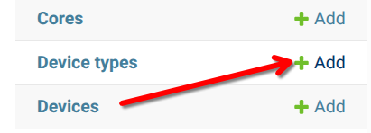
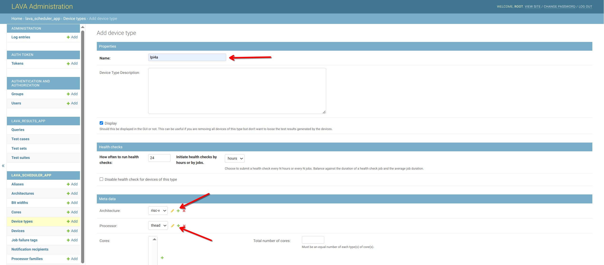
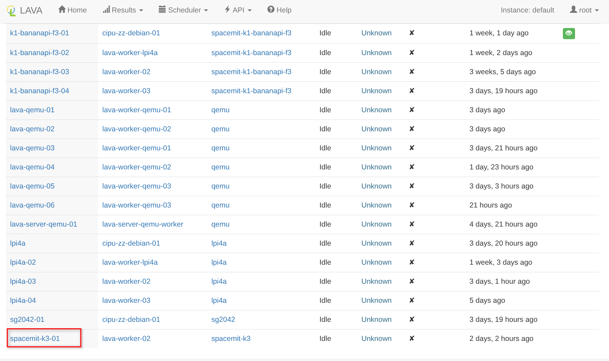

# 添加一个实体设备 - SpacemiT K3

## 为 K3 添加 Device Type





## 配置 worker 的 TFTP

K3 通过 tftpboot 加载固件，内核，设备树相关文件，需要先在 worker 机器上安装并配置 tftp。安装 lava-dispatcher 时会默认安装 tftpd-hpa ，若没有则：

```bash
sudo apt install tftpd-hpa
```

检查 `/etc/default/tftpd-hpa`：

```bash
TFTP_USERNAME="tftp"
TFTP_DIRECTORY="/srv/tftp"
TFTP_ADDRESS=":69"
TFTP_OPTIONS="--secure"
```

重启并检查服务：

```bash
sudo systemctl restart tftpd-hpa
sudo systemctl status tftpd-hpa --no-pager
```

LAVA dispatcher 的 `TFTP_DIRECTORY` 必须与 `/srv/tftp` 一致。K3 需要能够访问 worker 的 UDP 69 端口和 TFTP 数据端口。

## 配置 worker 的 NFS

K3 通过 NFS 的方式获取文件系统相关文件，需要在 worker 安装并配置 NFS server。安装 lava-dispatcher 时会默认安装 nfs-kernel-server ，若没有则：

```bash
sudo apt install nfs-kernel-server
```

将以下配置写入或合并到 `/etc/exports.d/lava-dispatcher-nfs.exports`：

```exports
/var/lib/lava/dispatcher/tmp *(rw,no_root_squash,async,no_subtree_check,crossmnt)
```

加载并检查导出：

```bash
sudo exportfs -rav
sudo exportfs -v
sudo systemctl status nfs-kernel-server --no-pager
```

## 配置串口连接

### 安装 ser2net

```bash
sudo apt install ser2net
```

### 配置 ser2net

将以下 connection 添加到 worker 的 `/etc/ser2net.yaml` 末尾：

```yaml
connection: &spacemit_k3
  accepter: telnet(rfc2217),tcp,localhost,15203
  enable: on
  options:
    kickolduser: true
    telnet-brk-on-sync: true
  connector: serialdev,/dev/ttyUSB2,115200n81,local
```

重启并验证：

```bash
sudo systemctl restart ser2net
sudo systemctl status ser2net --no-pager
telnet localhost 15203
```

当前 K3 的串口在 worker 的 `/dev/ttyUSB2`。如果 USB 串口重插后编号会变化，或者在不同的串口设备上则需要更改为对应的配置。

K3 的 U-Boot 用一个空格打断自动启动。这里必须使用 `telnet(rfc2217),tcp` accepter，使 telnet 客户端立即发送单个字符。使用裸 `tcp,localhost,15203` 时，空格可能留在客户端行缓冲中，直到换行后才发往串口，就会出现两个 `=>` 提示符，LAVA 在 U-Boot 的输入顺序就会超前，导致命令运行失败。


## 配置电源控制

将 SpacemiT K3 电源连接到 HA 的插座上，并获取对应的 `entity_id`，将控制电源开关的 curl 命令保存到 worker 机器上，如 `/home/zhtianyu/spacemit-k3/`：

```text
/home/zhtianyu/spacemit-k3/power_on
/home/zhtianyu/spacemit-k3/power_off
/home/zhtianyu/spacemit-k3/hard_reset
```

具体内容类似：
```Bash
zhtianyu@debian:~$ cat spacemit-k3/power_on 
#!/bin/bash 

curl -X POST -H "Authorization: Bearer <HOME_ASSISTANT_TOKEN>" -H "Content-Type: application/json" 
-d '{"entity_id":"switch.cuco_cn_631877811_cp1d_on_p_2_1"}' http://10.213.5.145:8123/api/services/switch/turn_on 

zhtianyu@debian:~$ cat spacemit-k3/power_off 
#!/bin/bash 

curl -X POST -H "Authorization: Bearer <HOME_ASSISTANT_TOKEN>" -H "Content-Type: application/json" 
-d '{"entity_id":"switch.cuco_cn_631877811_cp1d_on_p_2_1"}' http://10.213.5.145:8123/api/services/switch/turn_off 
zhtianyu@debian:~$ cat spacemit-k3/hard_reset  
#!/bin/bash 
cd /home/zhtianyu/spacemit-k3 || exit 1 
./power_off && sleep 10 && ./power_on
```

添加脚本的可执行权限：

```bash
chmod +x /home/zhtianyu/spacemit-k3/power_on
chmod +x /home/zhtianyu/spacemit-k3/power_off
chmod +x /home/zhtianyu/spacemit-k3/hard_reset
```

## 编写 K3 Device Type 模板

在 LAVA server 创建：

```text
/etc/lava-server/dispatcher-config/device-types/spacemit-k3.jinja2
```

模板内容：

```yaml
{# device_type = "spacemit-k3" #}
























```

### K3 device-type 基础模板详解

#### 继承 U-Boot 基础模板

```jinja2
{# device_type = "spacemit-k3" #}

```

`base-uboot.jinja2` 提供 LAVA 通用的 U-Boot deploy 和 boot 流程，包括：

- 生成 TFTP 文件路径和 NFS rootfs 路径；
- 连接串口并打断 uboot 的自动启动；
- 执行 DHCP、设置 TFTP server 和发送 U-Boot 命令；
- 根据 `booti_*_addr` 生成最终的 `booti` 命令；
- 根据 `extra_nfsroot_args` 和 `extra_kernel_args` 生成 `bootargs`。

K3 模板只覆盖板卡相关变量，不重复实现 LAVA 的 U-Boot 通用流程。`device_type` 所在行是 Jinja2 注释，用于标识模板对应的设备类型，不会生成到最终 device-type 中。

#### 设置架构和 initramfs 格式

```jinja2


```

- `uboot_mkimage_arch` 告诉 LAVA 当前 U-Boot 目标架构是 RISC-V。LAVA 在处理需要 U-Boot header 的镜像时会使用该架构。
- `uboot_ramdisk_format = 'raw'` 表示 job 提供的 initramfs 可以直接交给 `booti`，LAVA 不再通过 `mkimage` 添加 uImage header。K3 当前使用的 initramfs 是压缩 cpio，错误设置成 `uimage` 会导致 U-Boot 报 `Wrong Ramdisk Image Format` 或无法识别 initrd。

#### 设置 U-Boot 提示符和输入行为

```jinja2




```

- `bootloader_prompt` 是 LAVA 判断命令是否执行完成的 U-Boot 提示符。K3 使用 `=>`。
- `boot_character_delay` 让 LAVA 每发送一个字符后等待 100 ms，避免串口输入过快造成字符乱序等。
- `interrupt_char` 指定 LAVA 用一个空格打断 `Hit any key to stop autoboot` 倒计时。
- `uboot_interrupt_newline = False` 禁止在空格后附加换行。K3 只需要一个字符；附加换行会提前产生额外的 `=>`，后续命令可能错位/超前输出。

#### 设置 Linux 控制台

```jinja2


```

`console_device` 和 `baud_rate` 用于生成：

```text
console=ttyS0,115200n8
```

这里的 `ttyS0` 是 K3 内核中的控制台设备，不是 worker 上的 `/dev/ttyUSB2`。`/dev/ttyUSB2` 只出现在 ser2net 和 Device Dictionary 对应的 worker 配置中。

#### 设置高地址限制

```jinja2


```

LAVA 会把这两个变量转换为：

```text
setenv initrd_high 0xffffffffffffffff
setenv fdt_high 0xffffffffffffffff
```

`uboot_initrd_high` 和 `uboot_fdt_high`：设置初始 RAM 磁盘和设备树的高地址限制为最大值，表示允许使用的最高地址。

#### 设置三个固定加载地址

```jinja2



```

   1. `booti_kernel_addr`：内核的加载地址。
   2. `booti_dtb_addr`：设备树 Blob (DTB) 的加载地址。
   3. `booti_ramdisk_addr`：初始 RAM 磁盘的加载地址。

#### 设置 NFS 和内核启动参数

```jinja2


```

`base-uboot.jinja2` 负责生成 `root=/dev/nfs`、NFS server 地址、当前 job 的 rootfs 路径以及 `ip=dhcp`。K3 模板通过 `extra_nfsroot_args` 固定 NFSv4.1，最终参数类似：

```text
nfsroot=10.213.5.169:/var/lib/lava/dispatcher/tmp/<job-id>/extract-nfsrootfs-*,tcp,hard,vers=4.1,nolock
```

#### 定义 TFTP 下载顺序

```jinja2

```

`tftpboot {KERNEL_ADDR} {KERNEL}`：从 TFTP 服务器下载内核到指定的加载地址。
`tftpboot {RAMDISK_ADDR} {RAMDISK}`：从 TFTP 服务器下载 initramfs 到指定的加载地址。
`setenv initrd_size ${filesize}`:在 initramfs 下载完成后，把它的实际文件大小保存到 initrd_size 环境变量中，供后面的 booti 命令使用。
`tftpboot {DTB_ADDR} {DTB}`：下载设备树 Blob 到指定的加载地址。

## 添加 spacemit-k3 Device

在 LAVA 服务端执行：

```bash
lava-server manage devices add \
  --device-type spacemit-k3 \
  --worker lava-worker-02 \
  spacemit-k3-01
```

执行成功后在 Web 界面 `Scheduler > Devices` 可以查询到



## 编写 K3 Device Dictionary

在 LAVA 服务端创建：

```text
/etc/lava-server/dispatcher-config/devices/spacemit-k3-01.jinja2
```

文件名必须与 LAVA Device 的名称一致。内容如下：

```yaml










```

Device Type 模板描述 K3 这一类设备的 U-Boot、内存地址和内核参数。Device Dictionary 描述 `spacemit-k3-01` 这一台设备的串口端口和电源控制脚本。

### K3 Device Dictionary 详解

#### 继承 K3 Device Type

```jinja2

```

这一行把 `spacemit-k3` 的 U-Boot 启动流程、固定加载地址、NFS 参数和控制台参数应用到 `spacemit-k3-01`。同一型号的多台 K3 共用一个 Device Type，每台实体设备各自保存一份 Device Dictionary。

Device Dictionary 文件名必须与 LAVA 中注册的 Device 名称一致：

```text
Device 名称：spacemit-k3-01
文件名称：spacemit-k3-01.jinja2
```

#### 定义串口连接

```jinja2



```

- `connection_list` 声明这台设备提供一个名为 `uart0` 的连接。
- `connection_commands` 定义 LAVA dispatcher 连接 `uart0` 时执行的命令。命令在 Device 所绑定的 worker 上执行，所以 `localhost:15203` 指 worker 本机的 ser2net 端口，不是 LAVA server。
- `connection_tags` 把 `uart0` 标记为主要连接，并标识连接类型为 telnet。LAVA 使用 `primary` 连接完成 U-Boot 交互、登录和测试命令输入输出。

Device Dictionary 中的 telnet 命令与 worker 的 ser2net 配置必须保持一致：

```text
Device Dictionary: telnet localhost 15203
ser2net accepter:  telnet(rfc2217),tcp,localhost,15203
ser2net connector: /dev/ttyUSB2,115200 8N1
```

修改串口端口或串口设备时，需要同步更新 Device Dictionary 和 worker 的 `/etc/ser2net.yaml`。

#### 定义电源和复位命令

```jinja2




```

这些命令也在 worker 上执行：

- `power_on_command`：LAVA 启动作业或恢复设备时上电。
- `power_off_command`：LAVA 完成作业、取消作业或清理设备时断电。
- `hard_reset_command`：LAVA 需要硬复位时执行断电再上电。
- `soft_reboot_command`：当前 K3 接入没有依赖操作系统内的软重启流程，使用同一个 `hard_reset` 脚本保证设备回到确定的 U-Boot 初始状态。


#### Device Type 与 Device Dictionary 的职责

| 配置 | Device Type | Device Dictionary |
| --- | --- | --- |
| U-Boot 启动方式 | 是 | 否 |
| 内核、initramfs、DTB 加载地址 | 是 | 否 |
| Linux 控制台和内核参数 | 是 | 否 |
| TFTP 命令顺序 | 是 | 否 |
| 实体串口连接端口 | 否 | 是 |
| 电源和复位脚本路径 | 否 | 是 |
| 单台设备名称 | 否 | 是 |

新增第二台 K3 时，应继续继承 `spacemit-k3.jinja2`，只为新设备创建 Device Dictionary，并修改它独有的 ser2net 端口和电源脚本。例如：

```text
/etc/lava-server/dispatcher-config/devices/spacemit-k3-02.jinja2
```

这样可以让所有 K3 共享同一 device-type 文件，同时避免一台设备的串口或电源配置影响其他设备。


## spacemit-k3 job

```yaml
device_type: spacemit-k3
job_name: spacemit-k3-rootfs-ltp-math-Test
timeouts:
  job:
    minutes: 10250
  action:
   minutes: 10249
  actions:
    power-off:
      seconds: 60
priority: medium
visibility: public
metadata:
  # please change these fields when modifying this job for your own tests.
  format: Lava-Test Test Definition 1.0
  name: spacemit-k3-test
  description: "test for spacemit-k3"
  version: "1.0"
# ACTION_BLOCK
actions:
# DEPLOY_BLOCK
- deploy:
    timeout:
      minutes: 120
    to: tftp
    os: debian
    dtb:
      url: http://10.30.191.33:12345/feb36fbac628e34e0a589ab03131890b6d0245ea/lib/dtbs/spacemit/k3-pico.dtb
    kernel:
      url: http://10.30.191.33:12345/feb36fbac628e34e0a589ab03131890b6d0245ea/Image
      type: image
    ramdisk:
      url: http://10.30.191.33:12345/feb36fbac628e34e0a589ab03131890b6d0245ea/initramfs.img
      install_overlay: False
      install_modules: False
    nfsrootfs:
      url: https://github.com/OERV-RVCI/RAVA_ROOTFS/releases/download/v20260714_072532/openEuler-24.03-LTS-SP3-RVA23-rootfs.tar.gz
      compression: gz
# BOOT_BLOCK
- boot:
    timeout:
      minutes: 20
    method: u-boot
    commands: nfs
    prompts: ["root@riscv64"]
    auto_login:
      login_prompt: "riscv64 login:"
      username: root
      password_prompt: "Password:"
      password: openEuler12#$
# TEST_BLOCK
- test:
      timeout:
        minutes: 10109
      definitions:
        - repository: https://github.com/RVCK-Project/lavaci.git
          from: git
          name: ltp-math-lpi4a-rootfs
          path: lava-testcases/common-test/ltp/ltp.yaml
          parameters:
            TST_CMDFILES: math
```

