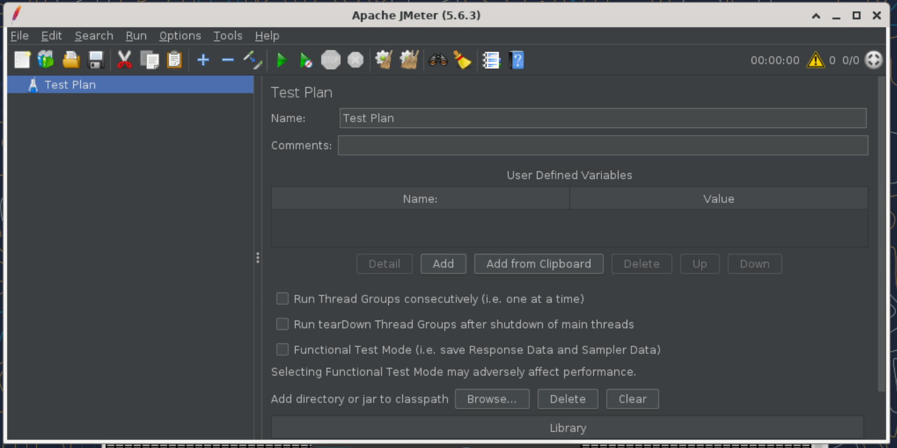

```bash
#查看系统有没有自带jdk，虽然java -version也能看
rpm -qa |grep java
rpm -qa |grep jdk
rpm -qa |grep gcj
#检索列表
yum list java*
dnf install -y java-21-openjdk.riscv64

[root@localhost ~]# java -version
Error occurred during initialization of VM
Unsupported satp mode: SV57. Only satp modes up to sv48 are supported for now.

dnf remove -y java-21-openjdk.riscv64
#貌似高版本jdk还不支持

#安装低版本jdk
dnf install -y java-1.8.0-openjdk-devel java-1.8.0-openjdk

#下载jmeter
https://dlcdn.apache.org//jmeter/binaries/apache-jmeter-5.6.3.zip


[root@localhost apache-jmeter-5.6.3]# java -version
openjdk version "1.8.0_442"
OpenJDK Runtime Environment BiSheng (build 1.8.0_442-b06)
OpenJDK 64-Bit Zero VM BiSheng (build 25.442-b06, interpreted mode)
[root@localhost apache-jmeter-5.6.3]# javac -version
javac 1.8.0_442

#设置好环境变量后
[root@localhost apache-jmeter-5.6.3]# jmeter -v
#
# A fatal error has been detected by the Java Runtime Environment:
#
#  Internal Error (cppInterpreter_zero.cpp:835), pid=2568, tid=0x00007fff8001a180
#  Error: Unimplemented()
#
# JRE version:  (8.0_442-b06) (build )
# Java VM: OpenJDK 64-Bit Zero VM (25.442-b06 interpreted mode linux-riscv64 )
# Core dump will be written, saved as:
#  /root/jmeter/apache-jmeter-5.6.3/core or core.2568        
#  or /var/lib/systemd/coredump/* (process core dumps by systemd-coredump)        
#  or /var/lib/apport/coredump/* (process core dumps by apport)        
#  or /var/spool/abrt/* (process core dumps by abrt-hook-ccpp)        
#  or other name defined in /proc/sys/kernel/core_pattern
#
# An error report file with more information is saved as:
# /root/jmeter/apache-jmeter-5.6.3/hs_err_pid2568.log
#
# If you would like to submit a bug report, please visit:
#   https://gitee.com/src-openeuler/openjdk-1.8.0/issues/
#
/root/jmeter/apache-jmeter-5.6.3/bin/jmeter: line 199:  2568 Aborted                 (core dumped) "$JAVA_HOME/bin/java" $ARGS $JVM_ARGS $JMETER_OPTS -jar "$PRGDIR/ApacheJMeter.jar" "$@"

#执行失败，java环境不支持，在qemu-system-riscv64里面
```

### 在oerv2403sp1的容器环境中

```bash
[root@MSI jmeter_test]# java -version
openjdk version "21.0.6" 2025-01-21
OpenJDK Runtime Environment BiSheng (build 21.0.6+7)
OpenJDK 64-Bit Server VM BiSheng (build 21.0.6+7, mixed mode, sharing)
[root@MSI jmeter_test]# javac -version
javac 21.0.6

[root@MSI apache-jmeter-5.6.3]# jmeter -v
Jun 12, 2025 1:56:23 AM java.util.prefs.FileSystemPreferences$1 run
INFO: Created user preferences directory.
    _    ____   _    ____ _   _ _____       _ __  __ _____ _____ _____ ____
   / \  |  _ \ / \  / ___| | | | ____|     | |  \/  | ____|_   _| ____|  _ \
  / _ \ | |_) / _ \| |   | |_| |  _|    _  | | |\/| |  _|   | | |  _| | |_) |
 / ___ \|  __/ ___ \ |___|  _  | |___  | |_| | |  | | |___  | | | |___|  _ <
/_/   \_\_| /_/   \_\____|_| |_|_____|  \___/|_|  |_|_____| |_| |_____|_| \_\ 5.6.3

Copyright (c) 1999-2024 The Apache Software Foundation

[root@MSI ~]# jmeter
WARN StatusConsoleListener The use of package scanning to locate plugins is deprecated and will be removed in a future release
WARN StatusConsoleListener The use of package scanning to locate plugins is deprecated and will be removed in a future release
WARN StatusConsoleListener The use of package scanning to locate plugins is deprecated and will be removed in a future release
WARN StatusConsoleListener The use of package scanning to locate plugins is deprecated and will be removed in a future release
================================================================================
Don't use GUI mode for load testing !, only for Test creation and Test debugging.
For load testing, use CLI Mode (was NON GUI):
   jmeter -n -t [jmx file] -l [results file] -e -o [Path to web report folder]
& increase Java Heap to meet your test requirements:
   Modify current env variable HEAP="-Xms1g -Xmx1g -XX:MaxMetaspaceSize=256m" in the jmeter batch file
Check : https://jmeter.apache.org/usermanual/best-practices.html
================================================================================


```



```sh
jmeter -n -t nginx-test.jmx -l result.jtl -e -o report

[root@MSI jmeter_test]# jmeter -n -t nginx-test.jmx -l result.jtl -e -o report

Creating summariser <summary>
Created the tree successfully using nginx-test.jmx
Starting standalone test @ 2025 Jun 12 07:03:34 GMT (1749711814416)
Waiting for possible Shutdown/StopTestNow/HeapDump/ThreadDump message on port 4445
summary +    632 in 00:01:16 =    8.3/s Avg:  4119 Min:     5 Max: 16372 Err:     0 (0.00%) Active: 1 Started: 100 Finished: 99
summary +    368 in 00:00:09 =   42.4/s Avg:   697 Min:     4 Max:  6283 Err:     0 (0.00%) Active: 0 Started: 100 Finished: 100
summary =   1000 in 00:01:26 =   11.7/s Avg:  2860 Min:     4 Max: 16372 Err:     0 (0.00%)
Tidying up ...    @ 2025 Jun 12 07:05:09 GMT (1749711909955)
... end of run
```

运行结果见jmeter_test.tar
